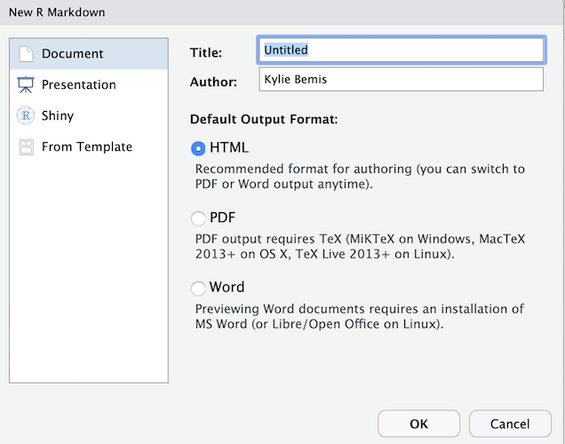
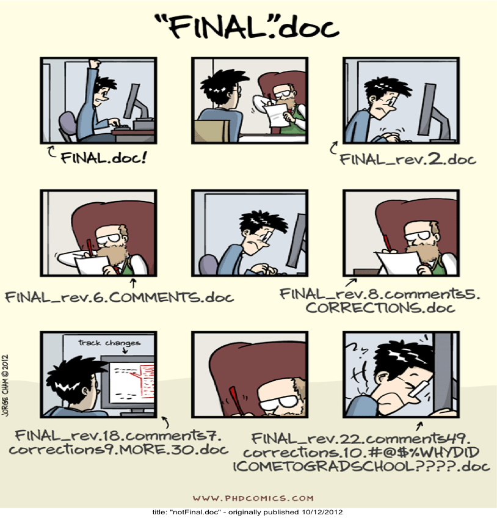

```{r setup, include=FALSE}
knitr::opts_chunk$set(echo = TRUE)
```

## Course materials

The course materials for this workshop can be found at:

- https://github.com/kuwisdelu/MayInstitute2020-IntermediateR

## Reproducible Workflows

Before even jumping into R code, let's explore some useful concepts to writing good code.

__Good workflows are reproducible.__

- *R Markdown* encourages reproducible data analysis by interweaving code and text to create attractive, fully reproducible reports

- *Git* and *Github* allow you to write good, reproducible code by tracking changes you make across source files


## Reproducible Workflows with R Markdown

Markdown is a markup language for writers that provides a simple way to encode document formatting using plain text syntax, and then convert it to attractive HTML or PDF output.

R Markdown is a flavor of markdown which allows R-users to embed R code into a markdown document\footnote{https://www.r-bloggers.com/r-markdown-and-knitr-tutorial-part-1/}. With R Markdown you can  create HTML, PDF, and MS Word documents.

## Create a R Markdown file

Click on the (+) sign on above left side of RStudio and choose "R Markdown"

{height=50%}

## Choose your format

Write down the title of your document and choose one of the default output formats.

{height=50%}

## R Markdown environment

A template R Markdown document will be created. Save it on your computer and then click on **"Knit"** to generate your PDF (or HTML or MS Word). 

{height=50%}

When you click the Knit button a document will be generated that includes both content as well as the output of any embedded R code chunks within the document. 

## Markdown markup

Markdown is a simple syntax for formatting a document. For example:

```
# Creates a header

## Creates a sub-header

*italic text*

**bold text**
```

Take a moment to explore some Markdown syntax in the **"rmarkdown.Rmd"** document.

## R code chunks

Chunks of R code are wrapped in a set of 3 backticks (\`) followed by `{r chunkname}`.

````markdown
`r ''````{r}
summary(iris)
```
````

## R code chunk example

When you Knit the document, the R code will be reproduced along with the result of running that code:

```{r}
1 + 1
```

## R chunk options

- include = FALSE

This option will prevent code and results to appear in the finished file. R Markdown still runs the code in the chunk, and the results can be used by other chunks.

````markdown
`r ''````{r include=FALSE}
library(ggplot2)
```
````

## R chunk options

- echo = FALSE

If you don't want to include the code in the finished file but you want to show the results of running the code, set `echo = FALSE`. This will prevent printing of the R code that generated the plot.

````markdown
`r ''````{r echo=FALSE}
ggplot(cars) + geom_point(aes(x=speed, y=dist))
```
````

This will produce the plot but without showing the code used to create it.

Since we used `library(ggplot2)` in the above chunk with `include = FALSE`, R Markdown can use it for other chunks and we don't need to add it to every chunk using a `ggplot2` function.

## R chunk options

- results = 'hide'

If you want to hide the results and only show the code, you can use `results='hide'`:

````markdown
`r ''````{r results='hide'}
ggplot(cars) + geom_point(aes(x=speed, y=dist))
```
````

## R chunk options

- eval = FALSE

If you want to show code without evaluating it, you can use `eval=FALSE`:

````markdown
`r ''````{r eval=FALSE}
ggplot(cars) + geom_point(aes(x=speed, y=dist))
```
````

## Set width and height and caption for a plot

You can set fig.width and fig.height to change the width and height of a plot.

````markdown
`r ''````{r fig.align='center', fig.height=1.5, fig.width=4}
ggplot(cars) + geom_point(aes(x=speed, y=dist))
```
````

You can use fig.cap="my caption" to add a caption to your plot as well.

## Naming and referencing code chunks

You can name code chunks to re-use them later. For example, here we show the code for producing a plot, but don't evaluate the code or create the plot yet.

````markdown
`r ''````{r car-plot, eval=FALSE}
ggplot(cars) + geom_point(aes(x=speed, y=dist))
```
````

You can then later reference the code chunk to produce the plot later:

````markdown
`r ''````{r car-plot, echo=FALSE}
```
````

## Useful References

See [https://www.rstudio.com/wp-content/uploads/2015/03/rmarkdown-reference.pdf](https://www.rstudio.com/wp-content/uploads/2015/03/rmarkdown-reference.pdf) for a complete list of chunk options.

For more details on using R Markdown see [http://rmarkdown.rstudio.com](http://rmarkdown.rstudio.com). 

Also see [http://commonmark.org/help/tutorial/](http://commonmark.org/help/tutorial/) for a step-by-step tutorial that introduces single Markdown concepts at each step.

## Reproducible Workflows with Git and Github



## Why we should use Git and Github?

### Situation 1
- You have written a paper. You name it “final”. 
- After a while, changing it to  “final_new”. 
- Making new changes.  Name it “final_really”! 

**What can go wrong?**

A year later, you open your folder and can’t remember which file was actually the final version of the paper!!

**Possible solution:**

Use numbers like final, final_1, final_2, etc . This way you can find the latest one.

**Disadvantage** 

You cannot keep track of the changes you made to paper to finally finalize it.

## Why we should use Git and Github?
### Situation 2
- Your project is now in a good state. 
- You want to make a huge change to some parts of the project. 

**What can go wrong?**

The project gets messy with lots of errors that you don’t know how to solve, and you wish to go back to the previous state of the project.

**Possible Solution:**

Always save a copy of the good state project

**Disadvantage:**

You have to do this process many times with different names.

## Why we should use Git and Github?

### Situation 3
- You and your teammate are working on the same project. 
- You and Your teammate make some changes to the project separately. 
- You will notify your teammate of your changes. She will notify you of her changes. 

**What can go wrong?**

Both of you have to manually find the changes and add them to your code. This is frustrating!

## Git and Github solve problems in previous situations

In next slides I will introduce the following concepts:

- Git
- Vesion control
- Repository
- Commit
- Github

## Git

- Git is a software that you install locally on your computer and you can handle version control of your files easily.

### Version Control

Version control means to take a snapshot of your files every time you edit them.

- Automatically tracks changes made to documents and projects
- Keeps a history log of all major and minor changes
- Allows reverting to earlier versions
- Compare different versions of documents
- Share and sync projects between people

## Repository

- When you start a Git project on your computer, you are going to store the entire history of the project locally. The storage of your project and its history is called a repository. 

## Commit

- Every time you save your work, you can commit your changes to Git. 
- A commit is a snapshot of all your files at a point in time. 
- Commits create links to other commits, forming a graph of your development history. 
- You can revert your code to a previous commit, inspect how files changed from one commit to the next, and review information such as where and when changes were made.

## Github

- Github is an online service that hosts git respositories for free 
- You can save your project and all the history of changes that Git has made for you in your local history.
- Once you commit something to repository, you can **push** them to Github.

**Advantages:**

- If something happens to your computer you will not lose your data.
- It lets you to work with a team easily. 

## Understanding git

To understand git, it's helpful to understand the four areas that git operates:

- The **working directory** is the actual directory on your computer where you're working

- The **staging area** is a set of files in your working directory that you've changed since your last *commit*

- Your **local repository** is the version of the git repo on your computer. It includes the files you can see in it, but also includes all the files and changes that have ever been part of your project history. These are hidden in an invisible `.git` directory that git uses.

- The **remote repository** is a version of the repository hosted on a remote site such as GitHub. This is where you share your code publicly. If you are working on a team, this is where the canonical version of your project lives while you work on your local versions.

---


---


## Hands on experience working with git and Github

- Install and set up git
- Register for Github
- Creating a git repository
- Git workflow
- Git branches

## Install and set up git
First check if git is already installed on your machine:

- Go to shell (Terminal) and type : git (if you get an error, it means that git is not installed)

### Download git
If git is not installed on your machine:

**Mac users:**

Download Git from https://git-scm.com/download/mac

**Windows users:**

Download Git from https://gitforwindows.org/

## Register for Github and make a repository

- Register for a free Github account : https://github.com
- Create a new repository. Name it something like "my-first-git".
- Write a brief description (For example : "I am trying to learn git.")
- Choose "public” (public repositories are free -- private repositories can be purchased with a paid account or if you're a student)
- Check the box "Initialize this repository with a README”
- Click "create repository”
- Click on "clone and download"- Copy the "web URL"

## Introduce yourself to git

Open a shell (Terminal) and type in your user name and email associated with your Github account.

```
git config --global user.name <your user name>
git config --global user.email <your email>
git config --global --list
```
## Creating a git repository

Although there exist GUIs for git, and many IDEs including RStudio feature git/GitHub integration, we will focus on understanding the fundamentals of the command line version.

Assuming you have git installed, just navigate to the directory that you want to track in your Terminal or command prompt by typing:

```
cd <your directory>
```

Then type:

```
git clone <the web URL from your github repository>
```

All of the files and subdirectories in that directory are now tracked by git.

However, it's still your responsibility to tell git when you make changes that you want git to record.

## Git workflow

Four basic commands will give you the bare minimum you need to navigate your git workflow:

- `git add` will add new or changed files to the *staging area*

    + `git add --all` will add all new or changed files to the staging area

- `git commit` will create a snapshot of the current state of your repo, along with a SHA-1 identifier, and a commit message

    + `git commit -m "my commit message"` is a shortcut for including your commit message with the command
  
- `git push <name of remote> <name of branch>` will push your most recent commits from your local repo to a remote repo

    + Typically `git push origin master`

- `git pull <name of remote> <name of branch>` will pull the most recent commits from a remote repo to your local repo

    + Typically `git pull origin master`
    
## A typical git workflow

A simple git/GitHub workflow when collaborating on a project with a team looks something like this:

1. Grab any changes by your teammates from GitHub with `git pull`

2. Make changes to your local repo (edit code, add files, etc.)

3. Stage those changes for commit with `git add`

4. Commit those changes to your local repo with `git commit`

5. Push your own changes to GitHub with `git push`

6. Repeat steps 1-5

While git will automatically merge as many changes as it can, when it finds conflicting changes, you will have to resolve these yourself, and then commit those changes.

## Git branches

If you want to make big changes to your code without messing up the main stream of development, then create a separate branch of the work, make your changes and if you are successful then merge it with orginal master branch.


## Git branches

Here are usefull commands for working with branches:

```
git checkout -b <new branch name>  (#create a new branch)
git checkout <branch-name>  (#switch to new branche)
git checkout master  (switch to branch master)
git branch  (#list of all available branches)
git merge <branch-name> (merge the new branch with master)
git branch -d <branch-name>  (delete the new branch)
```

## Useful references for further readings:

- http://r-pkgs.had.co.nz/git.html#commit-best-practice
- https://guides.github.com/
- http://blog.udacity.com/2015/06/a-beginners-git-github-tutorial.html
- http://kbroman.org/github_tutorial/

# R Fundamentals

## A brief history of R ##

- S created by John Chambers at Bell Laboratories in 1976
- "Turn ideas into software, quickly and faithfully"
- R created in 1993 as a free, open-source implementation of S
- Influenced by S, Scheme, Common Lisp, XLispStat

## Basic data types (atomic) ##

What are the four common types of 'atomic' data types in R?

Bonus: What are the two uncommon data types?

## Basic data types (atomic) ##

There are six 'atomic' data types:

- **character**
- **double**
- **integer**
- **logical**
- raw
- complex

Most of the time, R will not distinguish between integer and double, as both are considered *numeric* vectors by R.

----

```{r}
"a"
1
1L
TRUE
```

----

- Everything is a vector in R

- "Scalars" are actually length-1 vectors

- Vectors of atomic types are created using __c()__

- Sequences of integers can be shortcut via __start:end__

- Assignment is done via __<-__

----

```{r}
c("a", "b", "c", "d")
c(1, 2.2, 3.33, 4.444)
c(1L, 2L, 3L, 4L)
c(TRUE, FALSE, TRUE, NA)
```

----

```{r}
x <- c(1, 2, 3, 4)
x
y <- 1:4
y
```

## Basic data types (non-atomic)

Atomic vector types are used to build more complex data types:

- matrix
- array
- list
- data.frame

This class will primarily discuss and make use of data.frames, which are the most common way of storing data in R.

For most types of data, systematic and tidy use of data.frames makes data analysis quick and easy.

----

```{r}
matrix(c(1, 2, 3, 4), nrow=2, ncol=2)
```

----

```{r}
array(1:12, dim=c(2,3,2))
```

----

```{r}
list(1L, "a", 3.14)
```

----

```{r}
data.frame(x=c(1, 2, 3), y=c("a", "b", "c"))
```

----

The table below visualizes the relationship between these basic data types:

R data types | Same types | Different types
-------------|------------|----------------
   1d        |  vector    |  list
   2d        |  matrix    |  data.frame
   nd        |  array     |  <NA>
   
## Subsetting in R

What are the three subsetting operators in R?

## Subsetting in R

The three subsetting operators are:

- `[

- `[[`

- `$`

What can we put inside of the `[` operator?

## Subsetting with `[`

- **blank**: include all

- **integer**:

    + positive: include these elements
    
    + 0: drop all elements
    
    + negative: drop these elements
    
- **logical**: include TRUEs

- **character**: lookup by name

----

Objects in R can be subsetted in multiple ways:

R subscripts         | Simplifying    | Preserving
---------------------|----------------|-----------
vectors              | x[[1]]         | x[1:6]
matrices/data.frames | x[,1]          | x[,1,drop=FALSE]
lists                | x[[1]], x$name | x[1]

Also note that data.frames are actually a special type of list, and can also be subset in the same ways that a list can.

## Subsetting: "simplying" versus "preserving"

When subsetting non-atomic data types (e.g., lists), subsetting operations may be distinguished by whether they return:

- An object of the same type (e.g., another list)

- An simpler object that was contained in the original object (e.g., a vector inside a list)

For example, if `z` is a list:

- `z[1]` returns a list of length 1, including the first element of `z`

- `z[[1]]` returns the first element of `z` (exactly)

----

```{r}
z <- list(1L, "a", 3.14)
z[1:2]
z[1]
z[[1]]
```

----

```{r}
df <- data.frame(x=c(1, 2, 3), y=c("a", "b", "c"))
df$x
df[,"y"]
df[1:2,]
```

## Control flow

Control flow in R includes `if`/`else` statements, `while` loops, and `for` loops, and the `switch` function.

```{r}
if (TRUE) {
  print(1)
} else {
  print(2)
}
```

```{r}
i <- 1
while(i < 3) {
  print(i)
  i <- i + 1
}
```

## Control flow

Control flow in R includes `if`/`else` statements, `while` loops, and `for` loops, and the `switch` function.

```{r}
if (TRUE) {
  print(1)
} else {
  print(2)
}
```

## Control flow (cont'd)

```{r}
i <- 1
while(i < 3) {
  print(i)
  i <- i + 1
}
```

## Control flow (cont'd)

```{r}
for ( i in 1:3 ) {
  print(i)
}
```

## Control flow (cont'd)

```{r}
x <- "b"
switch(x, a=1, b=2)
y <- 2
switch(y, "a", "b")
```

## Documentation

- Access help page for any R function using __help(name)__

- Syntactic sugar is available as __?name__

- You may need to quote special names with backticks
